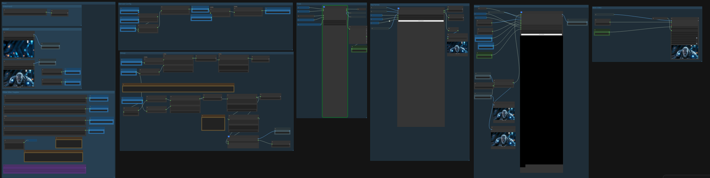

# Workflows ComfyUI Draft - Thanos

This repository contains a ComfyUI workflow for video generation using the LTX model. The workflow processes video content in clips, handling parameters such as scene dimensions (640x320), seed (322737872210006), clip durations, offsets, and keyframes for motion capture and blending.

**Note: This is a work in progress and not yet stable.**

BTW: if you have tips on how to do this better, let me know.  I'm not sure I've got the mocap pose + keyframe + leading image sequence quite right. 

My end goal is to have 4 workflows here that will work together.

You'll be able to pass in audio with multiple speakers, or video with multiple speakers, of very long lengths, and when the workflow is done, it'll spit out a full length video, with individual clip renders stitched together as smoothly and seamlessly as possible.

Shout out to the [LTX](https://github.com/Lightricks/LTX-2) and [Qwen](https://github.com/QwenLM/Qwen-Image) Teams. Because they have awesome kit to work with.

I intend to use more from Qwen with their new TTS solutions. Basically, for multiple speakers, where the speakers are overlapping one another, i'd use a
diarized transcript to find the speakers words in that space, and clone their voice from regions of the audio where only they are speaking, and use that to
re-synth the intertwined audio for just their character, so that we can drive just their character's lip sync. Then you can just re-blend the audio in your
video editor of choice and pick whatever coverage shot you want or use masking to lip sync the different characters in the same frame.